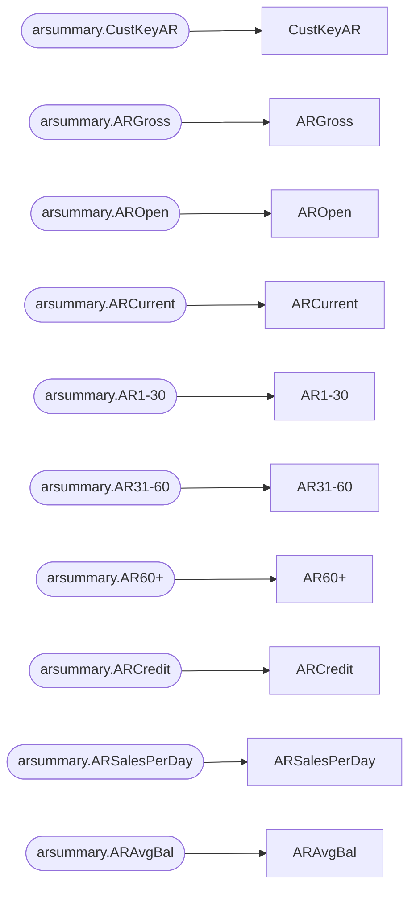

# Lineage — Executive Dashboard.qvs

## Table-level lineage

```mermaid
flowchart LR
  subgraph SOURCE
    n_source_accountgroupmaster["accountgroupmaster\n(qvd)"]
    n_source_accountmaster["accountmaster\n(qvd)"]
    n_source_accounts["accounts\n(qvd)"]
    n_source_arsummary_1["arsummary_1\n(qvd)"]
    n_source_arsummary["arsummary\n(qvd)"]
    n_source_budget["budget\n(qvd)"]
    n_source_calendar_2024["calendar_2024\n(qvd)"]
    n_source_channelmaster["channelmaster\n(qvd)"]
    n_source_customeraddressmaster["customeraddressmaster\n(qvd)"]
    n_source_customermap["customermap\n(qvd)"]
    n_source_customermaster["customermaster\n(qvd)"]
    n_source_expenses["expenses\n(qvd)"]
    n_source_facttable["facttable\n(qvd)"]
    n_source_historyflag["historyflag\n(qvd)"]
    n_source_inventorybalances["inventorybalances\n(qvd)"]
    n_source_itembranchmaster["itembranchmaster\n(qvd)"]
    n_source_itemmaster["itemmaster\n(qvd)"]
    n_source_productgroupmaster["productgroupmaster\n(qvd)"]
    n_source_productsubgroupmaster["productsubgroupmaster\n(qvd)"]
    n_source_producttypemaster["producttypemaster\n(qvd)"]
    n_source_salesrepmaster["salesrepmaster\n(qvd)"]
  end
  subgraph STAGING
    n_AccountGroupMaster["AccountGroupMaster"]
    n_AccountMaster["AccountMaster"]
    n_Accounts["Accounts"]
    n_ARSummary_1["ARSummary-1"]
    n_Budget["Budget"]
    n_Calendar["Calendar"]
    n_ChannelMaster["ChannelMaster"]
    n_CustomerAddressMaster["CustomerAddressMaster"]
    n_CustomerMap["CustomerMap"]
    n_CustomerMaster["CustomerMaster"]
    n_Expenses["Expenses"]
    n_HistoryFlag["HistoryFlag"]
    n_InventoryBalances["InventoryBalances"]
    n_ItemBranchMaster["ItemBranchMaster"]
    n_ItemMaster["ItemMaster"]
    n_ProductGroupMaster["ProductGroupMaster"]
    n_ProductSubGroupMaster["ProductSubGroupMaster"]
    n_ProductTypeMaster["ProductTypeMaster"]
    n_SalesRepMaster["SalesRepMaster"]
    n_table_23["table_23"]
  end
  subgraph MART
    n_ARSummary["ARSummary"]
    n_FactTable_Init["FactTable Init"]
    n_FactTable["FactTable"]
  end
  n_FactTable_Init --> n_FactTable
  n_source_accountgroupmaster --> n_AccountGroupMaster
  n_source_accountgroupmaster --> n_table_23
  n_source_accountmaster --> n_AccountMaster
  n_source_accounts --> n_Accounts
  n_source_arsummary --> n_ARSummary
  n_source_arsummary_1 --> n_ARSummary_1
  n_source_budget --> n_Budget
  n_source_calendar_2024 --> n_Calendar
  n_source_channelmaster --> n_ChannelMaster
  n_source_customeraddressmaster --> n_CustomerAddressMaster
  n_source_customermap --> n_CustomerMap
  n_source_customermaster --> n_CustomerMaster
  n_source_expenses --> n_Expenses
  n_source_facttable --> n_FactTable_Init
  n_source_historyflag --> n_HistoryFlag
  n_source_inventorybalances --> n_InventoryBalances
  n_source_itembranchmaster --> n_ItemBranchMaster
  n_source_itemmaster --> n_ItemMaster
  n_source_productgroupmaster --> n_ProductGroupMaster
  n_source_productsubgroupmaster --> n_ProductSubGroupMaster
  n_source_producttypemaster --> n_ProductTypeMaster
  n_source_salesrepmaster --> n_SalesRepMaster
  classDef source fill:#DDEBF7,stroke:#2E75B6;
  classDef mart fill:#FCE4D6,stroke:#C55A11;
  class n_source_accountgroupmaster n_source_accountmaster n_source_accounts n_source_arsummary_1 n_source_arsummary n_source_budget n_source_calendar_2024 n_source_channelmaster n_source_customeraddressmaster n_source_customermap n_source_customermaster n_source_expenses n_source_facttable n_source_historyflag n_source_inventorybalances n_source_itembranchmaster n_source_itemmaster n_source_productgroupmaster n_source_productsubgroupmaster n_source_producttypemaster n_source_salesrepmaster source;
  class n_ARSummary n_FactTable_Init n_FactTable mart;
```

## Column lineage — ARSummary



## Column lineage — FactTable Init


## Column lineage — FactTable

```mermaid
flowchart LR
  n_FactTable_MonthlyRegionKey["MonthlyRegionKey"]
  n_facttable_MonthlyRegionKey(["facttable.MonthlyRegionKey"])
  n_facttable_MonthlyRegionKey --> n_FactTable_MonthlyRegionKey
  n_FactTable_Region["Region"]
  n_facttable_Region(["facttable.Region"])
  n_facttable_Region --> n_FactTable_Region
  n_FactTable_Address_Number["Address Number"]
  n_facttable_Address_Number(["facttable.Address Number"])
  n_facttable_Address_Number --> n_FactTable_Address_Number
  n_FactTable_CustKey["CustKey"]
  n_facttable_CustKey(["facttable.CustKey"])
  n_facttable_CustKey --> n_FactTable_CustKey
  n_FactTable_Invoice_Number["Invoice Number"]
  n_facttable_Invoice_Number(["facttable.Invoice Number"])
  n_facttable_Invoice_Number --> n_FactTable_Invoice_Number
  n_FactTable_Item_Branch_Key["Item-Branch Key"]
  n_facttable_Item_Branch_Key(["facttable.Item-Branch Key"])
  n_facttable_Item_Branch_Key --> n_FactTable_Item_Branch_Key
  n_FactTable_Late_Shipment["Late Shipment"]
  n_facttable_Late_Shipment(["facttable.Late Shipment"])
  n_facttable_Late_Shipment --> n_FactTable_Late_Shipment
  n_FactTable_Line_Desc_1["Line Desc 1"]
  n_facttable_Line_Desc_1(["facttable.Line Desc 1"])
  n_facttable_Line_Desc_1 --> n_FactTable_Line_Desc_1
  n_FactTable_Open_Order_Amount["Open Order Amount"]
  n_facttable_Open_Order_Amount(["facttable.Open Order Amount"])
  n_facttable_Open_Order_Amount --> n_FactTable_Open_Order_Amount
  n_FactTable_Order_Number["Order Number"]
  n_facttable_Order_Number(["facttable.Order Number"])
  n_facttable_Order_Number --> n_FactTable_Order_Number
  n_FactTable_Order_Status["Order Status"]
  n_facttable_Order_Status(["facttable.Order Status"])
  n_facttable_Order_Status --> n_FactTable_Order_Status
  n_FactTable_OrderDate["OrderDate"]
  n_facttable_OrderDate(["facttable.OrderDate"])
  n_facttable_OrderDate --> n_FactTable_OrderDate
  n_FactTable_OrderID["OrderID"]
  n_facttable_OrderID(["facttable.OrderID"])
  n_facttable_OrderID --> n_FactTable_OrderID
  n_FactTable_OrderStat["OrderStat"]
  n_facttable_OrderStat(["facttable.OrderStat"])
  n_facttable_OrderStat --> n_FactTable_OrderStat
  n_FactTable_Promised_Delivery_Date["Promised Delivery Date"]
  n_facttable_Promised_Delivery_Date(["facttable.Promised Delivery Date"])
  n_facttable_Promised_Delivery_Date --> n_FactTable_Promised_Delivery_Date
  n_FactTable_Sales_Amount["Sales Amount"]
  n_facttable_Sales_Amount(["facttable.Sales Amount"])
  n_facttable_Sales_Amount --> n_FactTable_Sales_Amount
  n_FactTable_Sales_Cost_Amount["Sales Cost Amount"]
  n_facttable_Sales_Cost_Amount(["facttable.Sales Cost Amount"])
  n_facttable_Sales_Cost_Amount --> n_FactTable_Sales_Cost_Amount
  n_FactTable_Sales_Margin_Amount["Sales Margin Amount"]
  n_facttable_Sales_Margin_Amount(["facttable.Sales Margin Amount"])
  n_facttable_Sales_Margin_Amount --> n_FactTable_Sales_Margin_Amount
  n_FactTable_Sales_Price["Sales Price"]
  n_facttable_Sales_Price(["facttable.Sales Price"])
  n_facttable_Sales_Price --> n_FactTable_Sales_Price
  n_FactTable_Sales_Quantity["Sales Quantity"]
  n_facttable_Sales_Quantity(["facttable.Sales Quantity"])
  n_facttable_Sales_Quantity --> n_FactTable_Sales_Quantity
  n_FactTable_Ship_To["Ship To"]
  n_facttable_Ship_To(["facttable.Ship To"])
  n_facttable_Ship_To --> n_FactTable_Ship_To
  n_FactTable_YYYYMM["YYYYMM"]
  n_facttable_YYYYMM(["facttable.YYYYMM"])
  n_facttable_YYYYMM --> n_FactTable_YYYYMM
```


