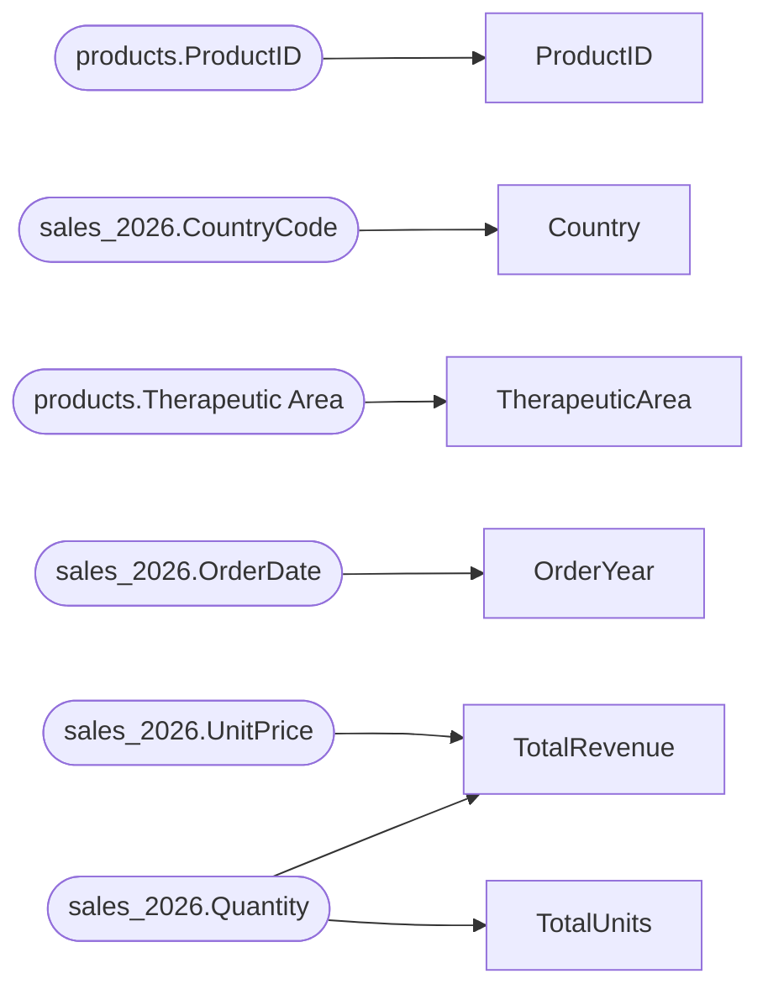

# Lineage — sales_pipeline.qvs

## Table-level lineage

```mermaid
flowchart LR
  subgraph SOURCE
    n_source_products["products\n(qvd)"]
    n_source_sales_2026["sales_2026\n(file)"]
    n_source_sales_2025["sales_2025\n(qvd)"]
  end
  subgraph STAGING
    n_Products["Products"]
    n_SalesPY["SalesPY"]
  end
  subgraph INTERMEDIATE
    n_SalesRaw["SalesRaw"]
    n_SalesRaw_join4["SalesRaw__join4"]
    n_SalesEnriched["SalesEnriched"]
    n_SalesEnriched_join6["SalesEnriched__join6"]
  end
  subgraph MART
    n_sales_fact["sales_fact"]
  end
  subgraph MAPPING
    n_CountryMap["CountryMap"]
  end
  n_CountryMap --> n_SalesRaw
  n_Products --> n_SalesEnriched_join6
  n_SalesEnriched --> n_sales_fact
  n_SalesEnriched_join6 --> n_SalesEnriched
  n_SalesRaw --> n_SalesEnriched
  n_source_products --> n_Products
  n_source_sales_2025 --> n_SalesPY
  n_source_sales_2026 --> n_SalesRaw
  classDef source fill:#DDEBF7,stroke:#2E75B6;
  classDef mart fill:#FCE4D6,stroke:#C55A11;
  class n_source_products n_source_sales_2026 n_source_sales_2025 source;
  class n_sales_fact mart;
```

## Column lineage — sales_fact


