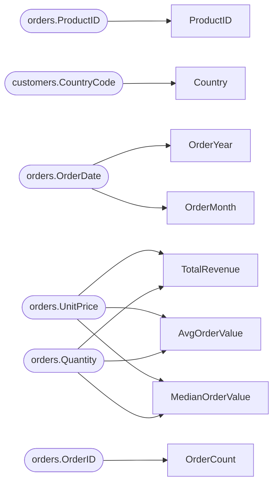

# Lineage — stress_test.qvs

## Table-level lineage

```mermaid
flowchart LR
  subgraph SOURCE
    n_source_customers["customers\n(qvd)"]
    n_source_orders["orders\n(qvd)"]
  end
  subgraph STAGING
    n_Customers["Customers"]
  end
  subgraph INTERMEDIATE
    n_Orders["Orders"]
    n_Orders_join3["Orders__join3"]
  end
  subgraph MART
    n_sales_fact["sales_fact"]
  end
  subgraph MAPPING
    n_map_1["map_1"]
  end
  n_Customers --> n_Orders_join3
  n_Orders --> n_sales_fact
  n_Orders_join3 --> n_Orders
  n_source_customers --> n_Customers
  n_source_orders --> n_Orders
  classDef source fill:#DDEBF7,stroke:#2E75B6;
  classDef mart fill:#FCE4D6,stroke:#C55A11;
  class n_source_customers n_source_orders source;
  class n_sales_fact mart;
```

## Column lineage — sales_fact


